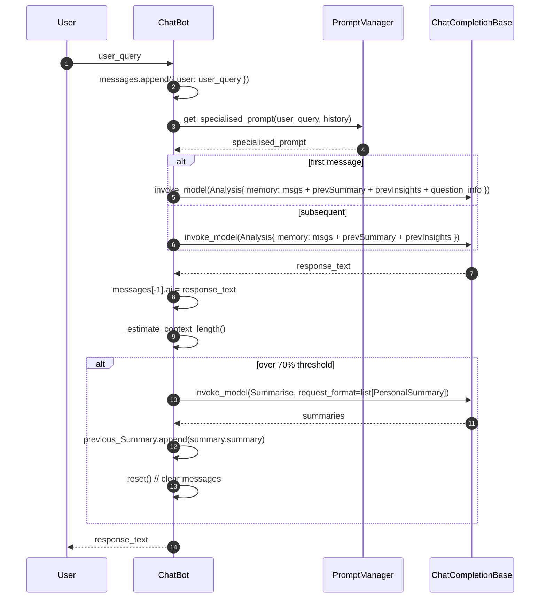

## ChatBot Functional Flow

### Actors
- User
- ChatBot
- PromptManager
- ChatCompletionBase (Gemini)

### Primary Flow (reply)
1. User sends `user_query`.
2. ChatBot appends `{ user: user_query }` to `self._messages`.
3. ChatBot asks PromptManager for a specialized prompt using `user_query` and history.
4. ChatBot builds `Analysis` payload memory:
   - First message: includes `messages?`, `previous context?` (from summaries), `previous insights?`, and `question_info?`.
   - Later messages: includes `messages?`, `previous context?`, `previous insights?`.
5. ChatBot calls Gemini via `chat.invoke_model(input=Analysis, ...)`.
6. Response text is attached to the latest message as `ai`.
7. ChatBot calls `_maybe_summarize()`:
   - Estimates tokens for messages + previous summaries + insights + system prompt
   - If over threshold (70% of max tokens):
     - Calls `summarize()` to get `PersonalSummary` list
     - Appends `summary_text.summary` to `self._previous_Summary`
     - Clears `self._messages`
8. Returns response text to the user.

### Summarize Flow
1. Build `Summarise(chat_history={ messages: self._messages })`.
2. Call `chat.invoke_model(input=summ_input, request_format={ type: "list", schema: PersonalSummary })`.
3. Extract structured result and persist into `self._previous_Summary`.

### Sequence Diagram

### Error and Edge Cases
- Model call failures: log and rethrow for upstream handling.
- Summarize failure: log warning and continue without rotation.
- Token estimate variance: conservative threshold (70%) and coarse char-to-token factor (2.5).

### Data
- Messages: transient, cleared after summarization.
- Previous Summary/Insights: rolling memory aiding long dialogs.
- DB: reserved for later persistence; not used yet.

